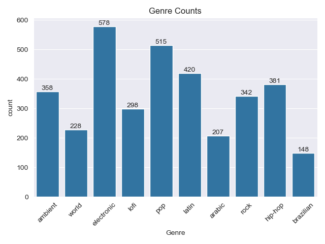
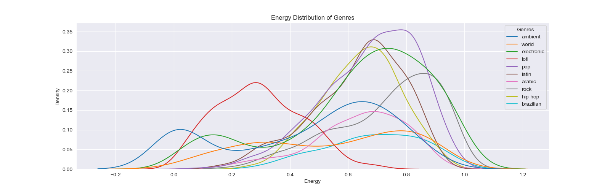
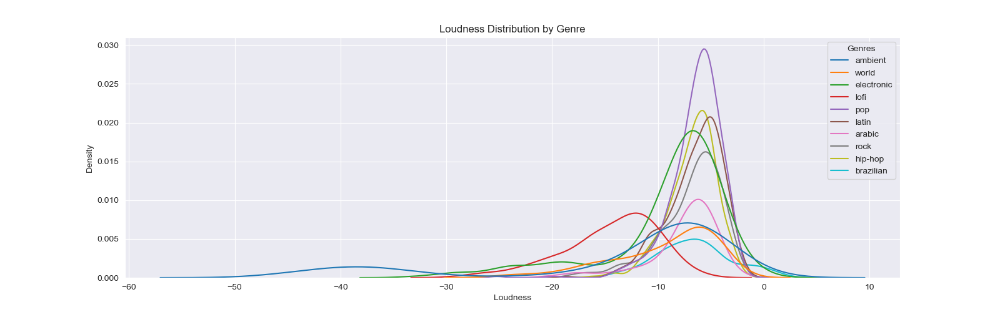

# Music-Genre-Prediction

## Problem Statement
- This dataset contains information about popular and non-popular songs on Spotify of various genres. This has been reduced to combine the 2 datasets into one, and removing unneeded features (such as track name, artist name, etc.). It also only utilizes the top 10 most common genres in the dataset. 

- The purpose of this analysis and modeling is to see if we can determine the genre from different properties, such as loudness, instrumentallness, acousticness, etc. 

## Data Dictionary
This data is from [Kaggle](https://www.kaggle.com/datasets/solomonameh/spotify-music-dataset/data). Data dictionary is available there. 

## Executive Summary

### Data Cleaning Steps
To clean the data, I dropped the rows with missing values (there was very few), then I had to reduce the number of rows, as there were too many to get usable information. 

I removed the columns that were not needed to predict genre, such as: track name, album name, artist, ids, etc, as these had no impact on the type of music. 

I also removed most of the genres of music, and only kept the top 10 most common genres. 

This reduced the number of rows enough to get some good analytics and visualizations from it. 

### Key Visualizations
Include key visualizations that highlight important aspects of the data. Use graphs, charts, or any other visual representation to make your points.

#### Visualization 1: [Distribution of Energy]
[Description and interpretation of the first visualization.]

#### Visualization 2: [Distribution of Loudness]
[Description and interpretation of the second visualization.]

## Conclusions/Recommendations
Summarize the main findings from your analysis. If applicable, provide recommendations based on the insights gained from the data.

## Additional Information
Include any additional information, references, or resources that might be relevant for understanding the analysis.

---

Feel free to replace the placeholders with your actual content. Additionally, if you have images for your visualizations, make sure to replace the placeholder paths with the correct file paths or URLs.

Once you've filled in the content, save the file with a `.md` extension (e.g., `README.md`). You can use this Markdown file on platforms like GitHub to provide a well-structured README for your analysis.
